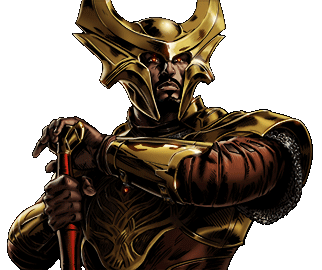

# Heimdall - Environment and Release Management

He is the all-seeing and all-hearing guardian sentry of Asgard, he stands on the rainbow bridge, Bifrost and stands watch for any attacks to Asgard.

## Build Status

## Problem

Release and Environment management is hard. As data centres grow, and the number of applications you support increases, so does the headache of tracking how resources are used. In an ideal world environments would be an endless resource and we could have as many as we liked, but the reality is these are finite and we should manage them accordingly.

## Solution

The purpose of Heimdall is to solve, or at least help reduce the problem described above. By tracking the resources you have, and knowing how long they will be in use can significantly reduce the amount of resource contention.